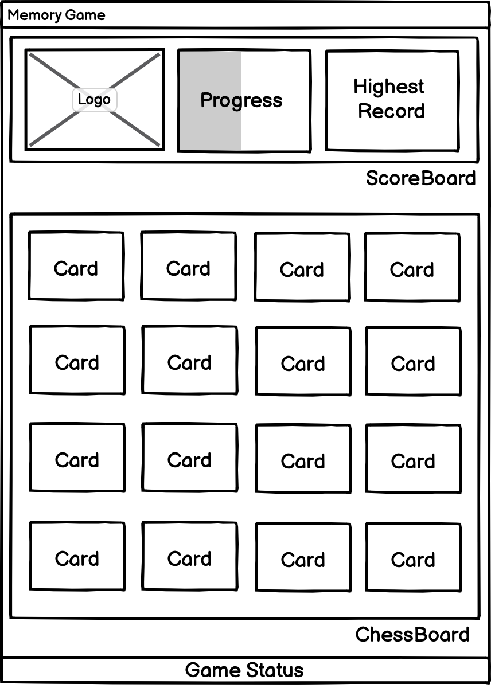

# vue-memory-game

![][david-url]
![][license-url]

A tiny game written in `vue3`. It's inspired by IgorMinar's [Memory-Game](https://github.com/IgorMinar/Memory-Game). You can view the online demo [here](http://leftstick.github.io/vue-memory-game).

> If you are looking for `angular5` version, check it [here](https://github.com/leftstick/angular5-memory-game)

> If you are looking for `react` version, check it [here](https://github.com/leftstick/react-memory-game)

[vite](https://vitejs.dev) is involved as build tool here.

## Components Tree



## Components break down

1. `Game`, the whole game board
2. `ScoreBoard`, the panel on the top, including "Logo", "Progress", "Highest Record"
3. `Logo`, on the left of `ScoreBoard`, showing the game Logo
4. `Progress`, on the center of `ScoreBoard`, showing the current matching information
5. `Score`, on the right of `ScoreBoard`, showing the best result
6. `ChessBoard`, on the center of `Game`, the playing area
7. `Card`, each card in the `Chessboard`
8. `GameStatus`, the footer part, displaying current status of game

## File Structure

```
vue-memory-game
├── src
|   ├── assets
|   |   ├── 8-ball.png
|   |   ├── ...
|   |   └── zeppelin.png
│   │
│   ├── components
│   │   ├── ChessBoard
│   │   │   ├── Card.vue
│   │   │   └── index.vue
│   │   ├── ScoreBoard
│   │   │   ├── index.vue
│   │   │   ├── Logo.vue
│   │   │   ├── Progress.vue
│   │   │   └── Score.vue
│   │   ├── GameStatus.vue
│   │   └── Game.vue
│   │
│   ├── stores
│   │   ├── CountTimer.ts
│   │   ├── GameStore.ts
│   │   └── index.ts
│   │
│   ├── Game.vue
│   ├── IType.ts
│   ├── main.ts
│   ├── shims-vue.d.ts
│   └── vite-env.d.ts
│
├── index.html
├── package.json
├── tsconfig.json
└── vite.config.ts
```

## Detail Explanation?

- [Chinese Edition](https://segmentfault.com/a/1190000005168085)

## Want Having a try locally?

### Running Environment

- [node.js](https://nodejs.org/en/), version `>=10`
- [yarn](https://classic.yarnpkg.com/lang/en/), version `~1`

### Recommended Editor

- [visual studio code](https://code.visualstudio.com/)

```bash
#cloning code
git clone https://github.com/leftstick/vue-memory-game.git
cd vue-memory-game

#install dependencies
yarn
#start debug server
yarn start
```

Now, view the demo at [http://localhost:3000/vue-memory-game/](http://localhost:3000/vue-memory-game/)

## LICENSE

[MIT License](https://raw.githubusercontent.com/leftstick/vue-memory-game/master/LICENSE)

[david-url]: https://david-dm.org/leftstick/vue-memory-game.png
[license-url]: https://img.shields.io/github/license/leftstick/vue-memory-game.svg
